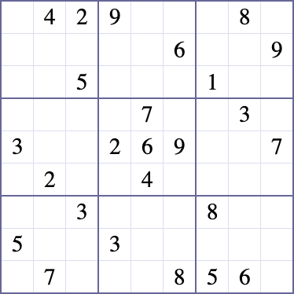
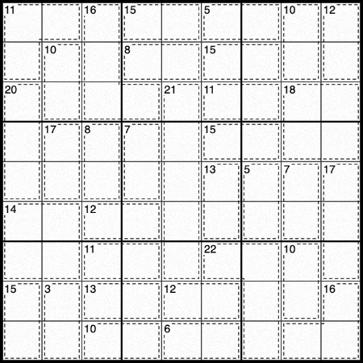

This repository contains an implementation of a Sudoku solver that solves the problem using
[integer programming](https://en.wikipedia.org/wiki/Integer_programming). It is written in Python
and uses the Google [OR-Tools](https://developers.google.com/optimization) library along with the
[SCIP](https://www.scipopt.org/) backend to solve instances.

This software is built and tested using [Bazel](https://bazel.build/) and
[rules_python](https://github.com/bazelbuild/rules_python). To build it, run

```
bazel build //:sudoku_solver
```

That command will deposit an executable script at `bazel-bin/sudoku_solver`. To run the software,
put your problem instance in an input file and pipe it into `stdin`; the solution will be written to
`stdout`. Here is an example input file and invocation:



[`example_sudoku.txt`](example_sudoku.txt):
```
(1,2):4
(1,3):2
(1,8):8
(2,6):6
(2,9):9
(3,3):5
(3,7):1
(4,5):7
(4,8):3
(5,1):3
(5,4):2
(5,5):6
(5,6):9
(5,9):7
(6,2):2
(6,5):4
(7,3):3
(7,7):8
(8,1):5
(8,4):3
(9,2):7
(9,6):8
(9,7):5
(9,8):6
```

Invoking the solver:
```
bazel-bin/sudoku_solver < example_sudoku.txt
```

The solution appears on `stdout`:
```
+-------+-------+-------+
| 6 4 2 | 7 9 1 | 3 8 5 |
| 1 3 7 | 5 8 6 | 2 4 9 |
| 8 9 5 | 4 3 2 | 1 7 6 |
+-------+-------+-------+
| 4 6 1 | 8 7 5 | 9 3 2 |
| 3 5 8 | 2 6 9 | 4 1 7 |
| 7 2 9 | 1 4 3 | 6 5 8 |
+-------+-------+-------+
| 9 1 3 | 6 5 7 | 8 2 4 |
| 5 8 6 | 3 2 4 | 7 9 1 |
| 2 7 4 | 9 1 8 | 5 6 3 |
+-------+-------+-------+
```

The solver can also solver killer Sudoku instances as well.



[`example_killer_sudoku.txt`](example_killer_sudoku.txt):
```
(1,1),(1,2),(2,1):11
(1,3),(2,3),(3,3),(3,4):16
(1,4),(1,5):15
(1,6),(1,7):5
(1,8),(2,8):10
(1,9),(2,9):12
(2,2),(3,2):10
(2,4),(2,5):8
(2,6),(2,7):15
(3,1),(4,1),(5,1):20
(3,5),(4,5),(5,5),(6,5),(7,5):21
(3,6),(3,7):11
(3,8),(3,9),(4,8),(4,9):18
(4,2),(5,2):17
(4,3),(5,3):8
(4,4),(5,4):7
(4,6),(4,7):15
(5,6),(6,6):13
(5,7),(6,7):5
(5,8),(6,8):7
(5,9),(6,9),(7,9):17
(6,1),(6,2),(7,1),(7,2):14
(6,3),(6,4):12
(7,3),(7,4):11
(7,6),(7,7),(8,7),(9,7):22
(7,8),(8,8):10
(8,1),(9,1):15
(8,2),(9,2):3
(8,3),(8,4):13
(8,5),(8,6):12
(8,9),(9,8),(9,9):16
(9,3),(9,4):10
(9,5),(9,6):6
```

Output:
```
+-------+-------+-------+
| 1 6 5 | 8 7 2 | 3 9 4 |
| 4 7 2 | 5 3 9 | 6 1 8 |
| 9 3 8 | 1 4 6 | 5 7 2 |
+-------+-------+-------+
| 5 9 1 | 4 2 7 | 8 3 6 |
| 6 8 7 | 3 1 5 | 4 2 9 |
| 2 4 3 | 9 6 8 | 1 5 7 |
+-------+-------+-------+
| 3 5 9 | 2 8 4 | 7 6 1 |
| 8 1 6 | 7 9 3 | 2 4 5 |
| 7 2 4 | 6 5 1 | 9 8 3 |
+-------+-------+-------+
```
